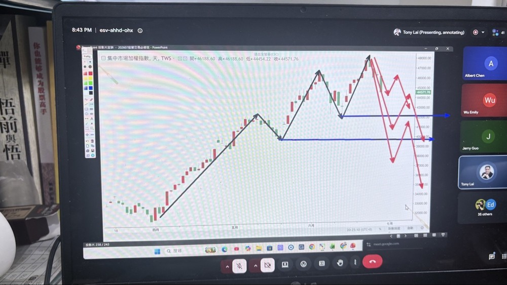
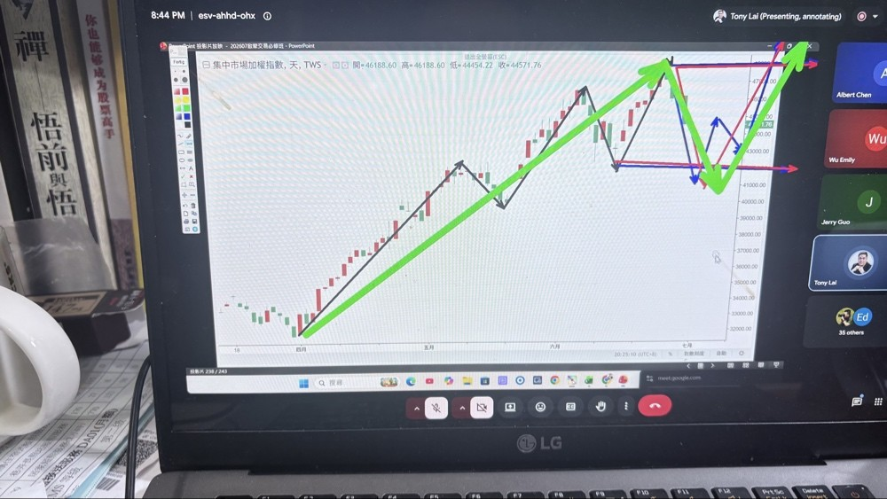
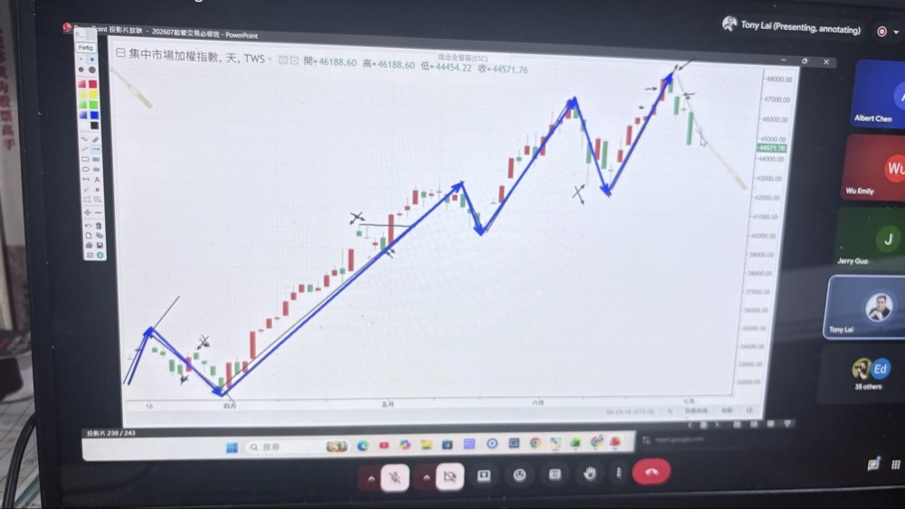
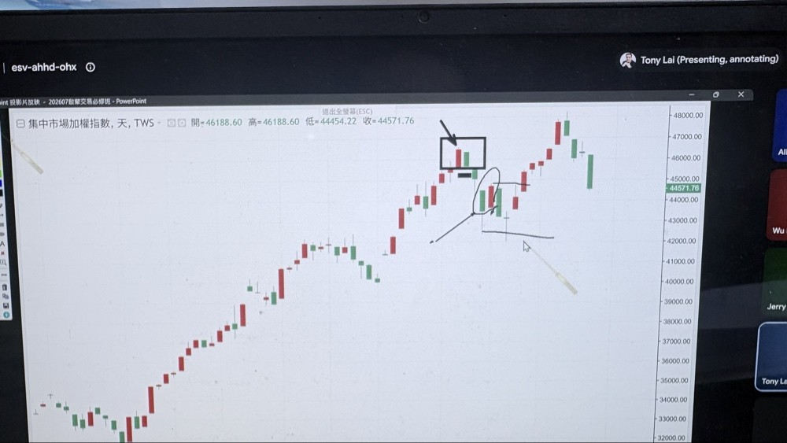
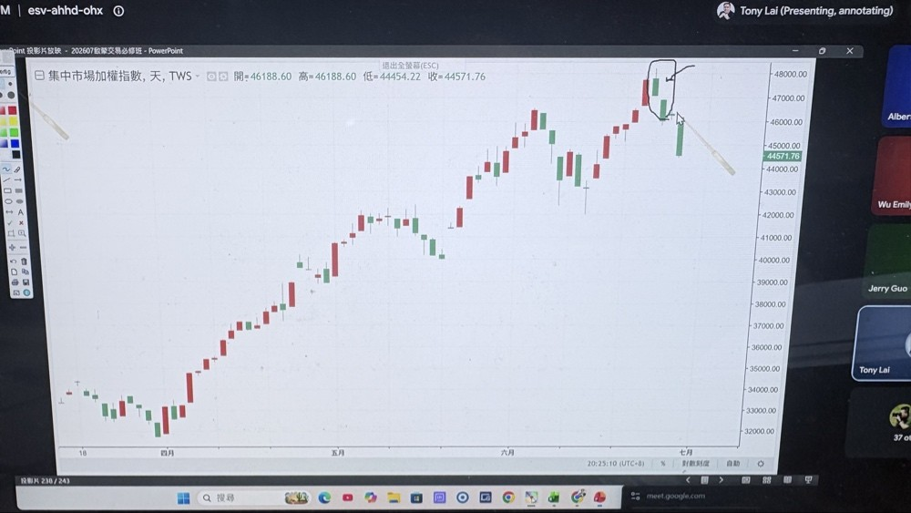
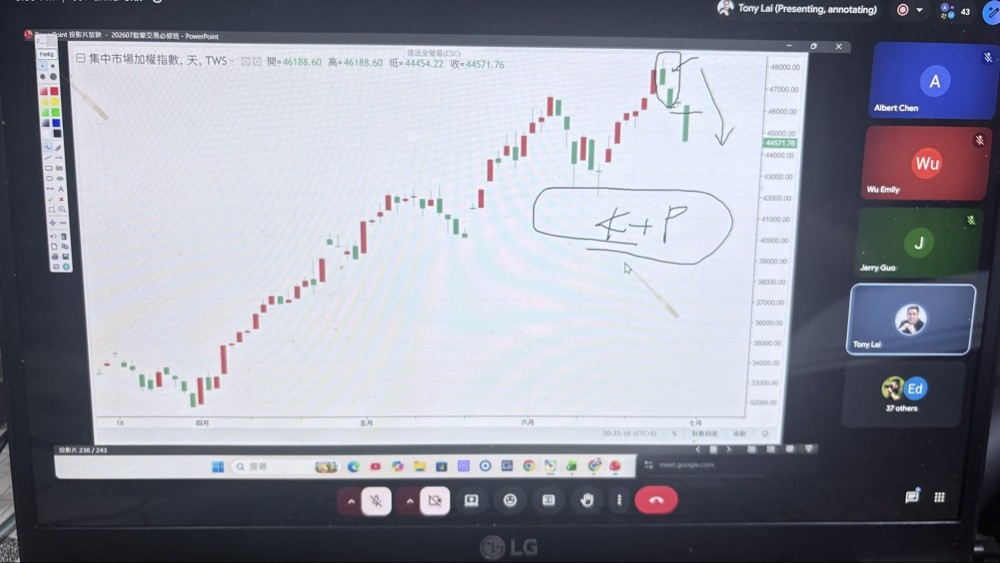

# 2026-06-30 直播

### 1. 2026-06-29 說明道氏 4 件事情，這個圖說明：

* **A. 道氏基本運動**
  多頭：高過高，低不破低 (black line)
* **B. 道氏三種可能反轉型態**
  強、中、弱 (red line)
* **C. 道氏防線** (blue line)

---

### 2. 道氏升級(破底穿頭) (blue and green line)

---

### 3. 樞紐點畫法

* **A. 規則**
  樞紐低必接樞紐高，樞紐高必接樞紐低，不會連續兩個樞紐低，或兩個樞紐高，中間的必須被取消；樞紐點畫完其實就是道氏 (blue line)。
* **B. 趨勢力道**
  可以看見多頭力道漸弱，空頭力道漸強。

---

### 4. 關鍵 K

* **A. 方格**
  紅包覆黑(聽牌)，又一根紅k(胡牌)
* **B. 圓形**
  紅貫穿黑(聽牌)，又一根黑k(聽牌失敗)

---

### 5. 黑貫穿黑(聽牌)，再一根黑k(胡牌)

---

### 6. K+P (關鍵K組合第一根也是樞紐高點，K+P常常是聽牌)

