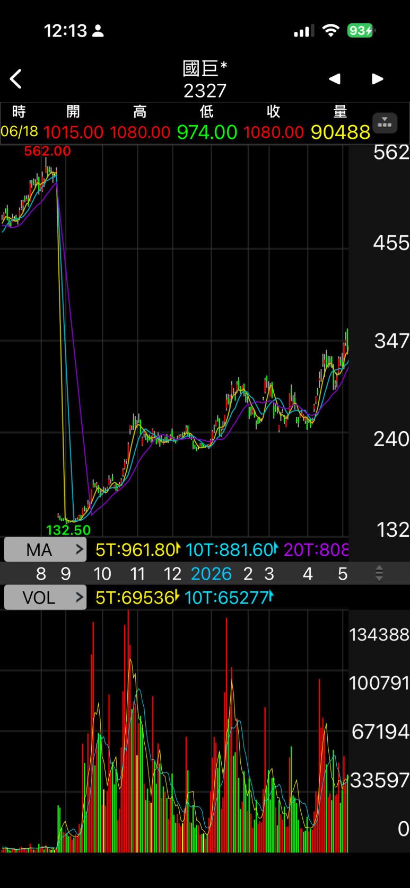
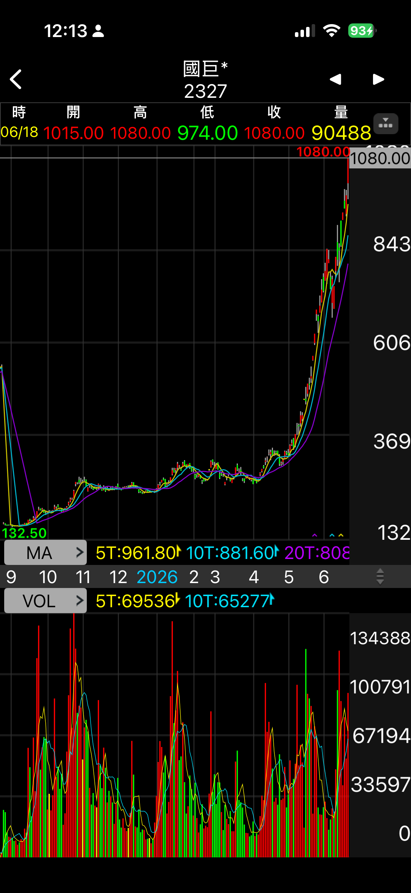
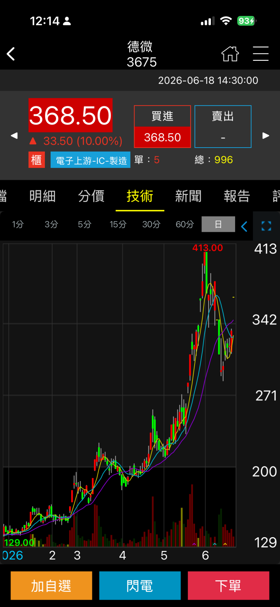
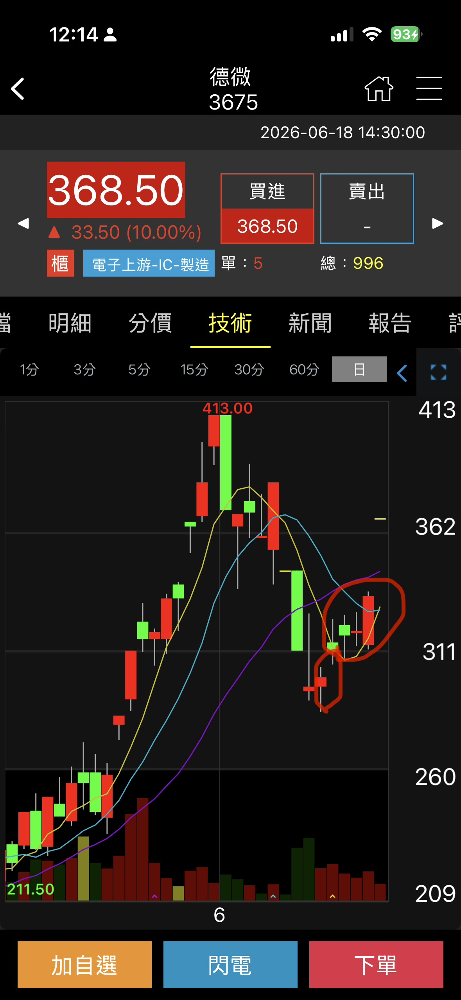
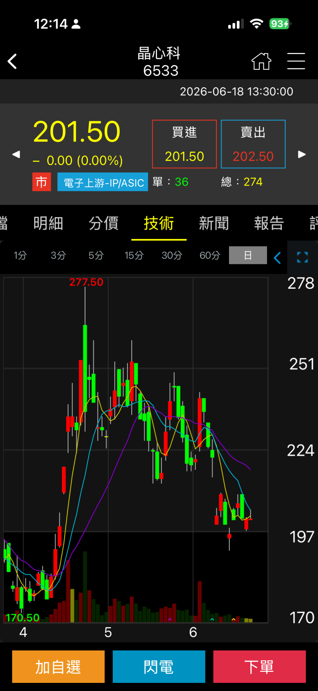

# 第七篇 啟蒙實戰案例探討

外功招式（道氏、左右、樞紐、關鍵K）在個股上的實戰運用與案例分析：

---

### 1. 國巨 (Yageo)

- **走勢研判**：此波走勢一路狂飆。若單看近期架構，並未出現明顯的道氏戰法，也找不到道氏防線，在分類上屬於左右戰法的「右右（確認突破直接衝出）」。
- **長線檢視**：然而，如果把線圖拉長檢視，前期其實是存在道氏防線的。
- **策略反思**：即便是「右右」的型態(常常短期套人)依然能實現獲利，顯示此類股票在當時極為強勢。可以大破規矩直接再買回(即使成本墊高)。

---

### 2. 德微 (Actron)

- **走勢研判**：先前早已出現道氏攻擊波，隨後的下跌整理屬於**「右左買點（突破大級別防線後的拉回測試點）」**，且在底部已出現樞紐點轉折向上的訊號。
- **實戰要點**：
  - 雖然右護法一開始表現偏弱，但因為大趨勢在道氏方向上是向上的，多頭慣性具有較大機率提供支撐。
  - **關鍵K線發動**：樞紐點向上（代表「一進聽」）後，雖然隨後是連續三根偏弱的右護法，但接著出現了一根**關鍵長紅K（代表「聽牌」）**。此時必須果斷出手，因為關鍵K發動後，隨後的「胡牌」就是一個跳空漲停板，一旦錯過就完全沒有進場買進的機會了。

---

### 3. 晶心科 (Andes Technology)

- **走勢研判**：可以看到晶心科還在打底階段。
- **分析與策略**：
  - **道氏大趨勢**：多頭尚未完全成形。
  - **樞紐點與關鍵K**：樞紐向上的右護法極弱，且此時也沒有出現任何關鍵K，因此這完全是風險最高、猜底部的**「左左買點」**。
  - **大級別研判**：但如果從稍大一點的日線或週線架構來看，因為之前有過突破，也可以被視為較大架構的**「右左買點」**。
